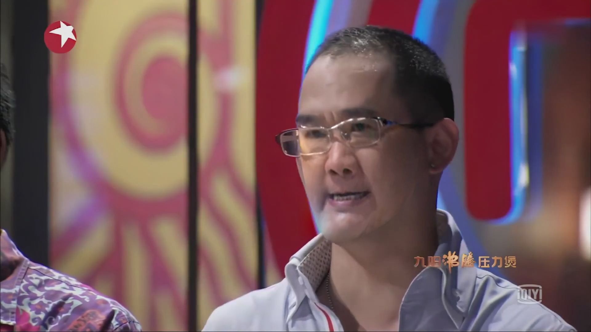
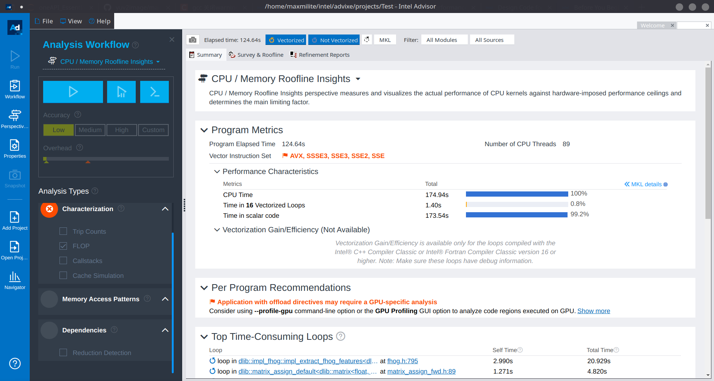
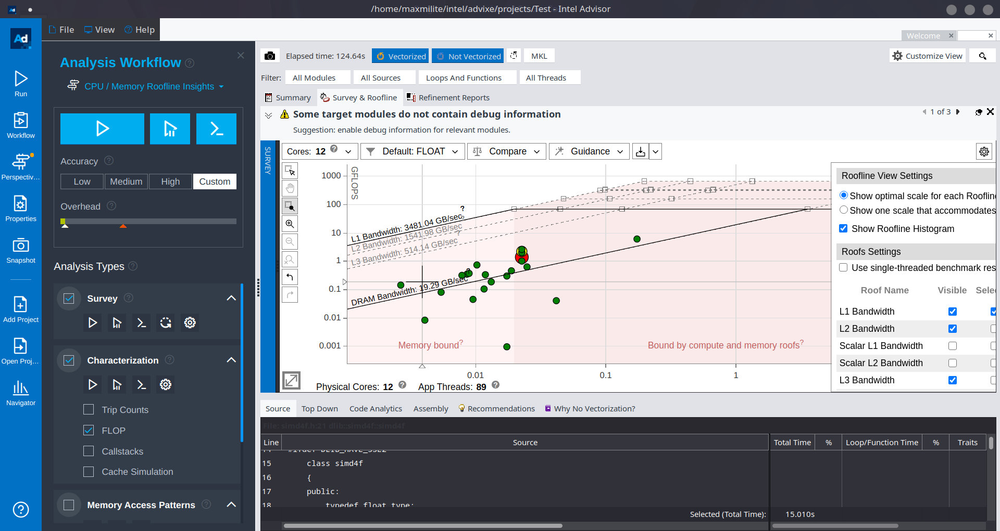

# FSOO Face Swap on oneAPI

这是山东大学泰山学堂 2022 级大一下学期高级程序设计第三次大作业的开发文档。

本工程利用 Intel oneAPI 的并行加速，利用 Intel oneAPI Video Processing Library 等 Intel oneAPI 工具包，及 OpenCV, dlib 等开源第三方库，实现了一个视频人像换脸的工具。



## 使用方法

由于项目限制，本项目仅允许对 `1920x1080` 的 H.264 视频进行人脸替换。

程序参数：`<程序文件名> <输入 H.264 视频名称> <人脸替换图片> <输出路径>`

使用方法：假设要转换的视频为 `input.mp4`，人脸替换图片为 `pattern.png`视频为 `output.mp4`。

```bash
cd build
cmake ..
make
cd ../dist
./main input.mp4 pattern.png output.mp4
```

## 简要运行原理

其使用 oneVPL，对读入的 H.264 视频进行解码，转为 `yuv` 格式的原始图像文件，并转换为 `png` 格式以便进一步处理。

在转码时，使用了 C++ SYCL 进行并行运算处理，加速了 `yuv` 转化为 `png` 中若干个过程（详见 [src/sycl/iamge_processing.h](../src/sycl/image_processing.h))。

此后，dlib 对分解出的图像进行处理。特别的，其中部分函数由于运算过多运行较慢。这里将这些函数所在的头文件进行了抽出并重新编写，融入 C++ SYCL，进行加速处理。

这里使用 Intel Advisor 对整个运行过程中耗时的部分进行了分析，对此表示感谢。





## 并行运算细节

1. 使用 oneVPL 进行视频解码，将 H.264 视频转换为 I420 YUV 原始格式，这里自动使用 Intel oneAPI 进行加速（参见 [src/sycl/onevpl_video_process.h](src/sycl/onevpl_video_process.h)）。
2. 将 I420 YUV 视频进行逐帧分割，并转换为 RGB PNG 格式。这里使用 C++ SYCL 进行加速（参见 [src/sycl/image_processing.h](src/sycl/image_processing.h)）。
3. 对视频进行逐帧人脸识别，具体步骤如下：
   1. 人脸关键点检测  
      该步骤使用 dlib 自带的机器学习检测完成。经过 Intel Advisor 检测，该步骤为耗时最多步骤，因此考虑将该步骤进行 C++ SYCL 加速处理。  
      通过分析，本次在函数中找到了耗时较多的若干部分。这一些部分使用了 `// Target: SLOW` 标注出，且对于若干部分，分析了时间复杂度以及优化方法。但是由于实现细节问题，仅对部分做出优化。
    2. 计算凸包  
       参见 `main.cpp` 中 `convexHull` 部分。
    3. 三角剖分，仿射变换  
       参见 `main.cpp` 中 `delaunay_triangulation` 和 `warp_triangle` 部分。
    4. 无缝缝合  
       参见 `main.cpp` 中 `seamlessClone` 部分。
4. 对 PNG 视频帧进行连接，这里使用与步骤 1, 2 相似的方法即可。由于实现细节重复，这里采用 `ffmpeg` 实现。
       
