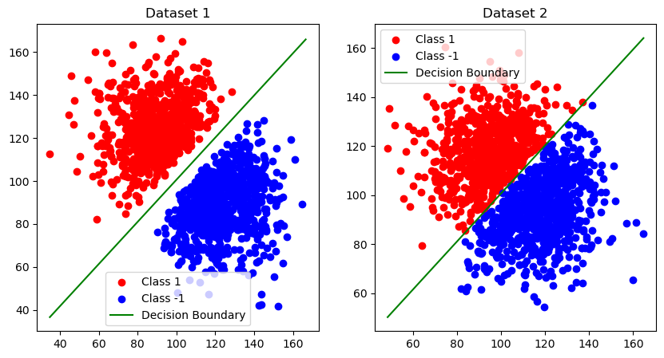
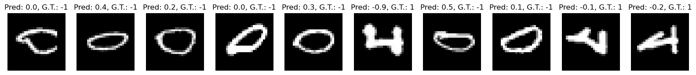
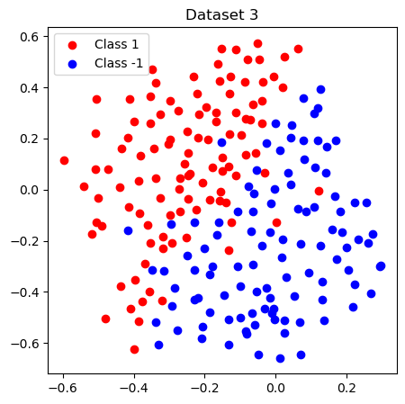
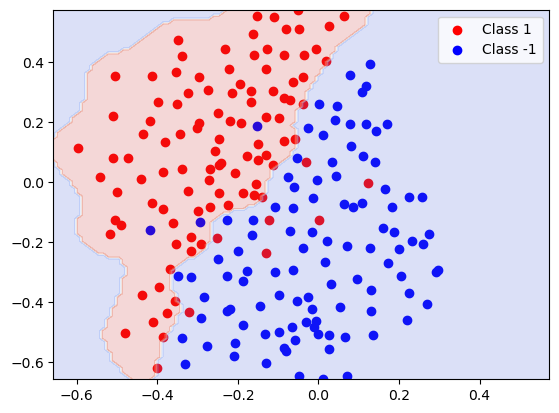
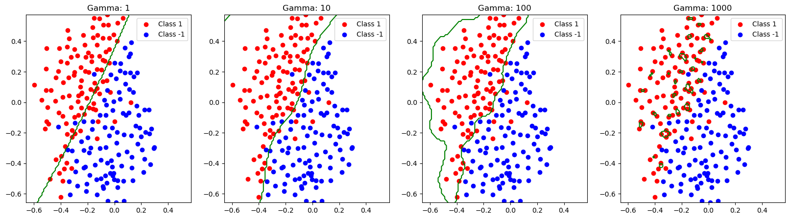

# Experiment 7 Report

<center>于斐, 202200130119. Dec. 11, 2024</center>


## Description

The following report shows the results of *SVM* experiment. [Python](https://python.org/) and [matplotlib](https://matplotlib.org/) is used to complete this experiemnt.

```python
dataset = [
    {
        "training": np.loadtxt("training_1.txt"),
        "test": np.loadtxt("test_1.txt")
    },
    {
        "training": np.loadtxt("training_2.txt"),
        "test": np.loadtxt("test_2.txt")
    }
]
x_train, y_train = dataset[0]["training"][:, :2], dataset[0]["training"][:, 2]
x_test, y_test = dataset[0]["test"][:, :2], dataset[0]["test"][:, 2] # take 0 as an example
```

## Linear SVM

The regularized SVM can be formulated as

$$
\begin{aligned}
\min \limits_{\omega, b, \xi} & \quad  \cfrac 12 || \omega ||^2  + C \sum \xi_i
\\
s.t. & \quad y^{(i)} (\omega^T x^{(i)} + b) \geq 1 - \xi_i \quad \forall i = 1, \cdots, m \\
& \quad \xi_i \geq 0 \quad \forall i = 1, \cdots, m
\end{aligned}
$$

and a dual problem can be denoted as

$$
\begin{aligned}
\max \limits_{\alpha} & \quad \sum \alpha_i - \cfrac 12 \sum y^{(i)} y^{(j)} \alpha_i \alpha_j \left< x^{(i)}, x^{(j)} \right>
\\
s.t. & \quad 0 \leq \alpha_i \leq C, \sum \alpha_i y^{(i)} = 0
\end{aligned}
$$

We use QP solver provided in `cvxopt` to solve the QP problem. The wrapped SVM class is shown as follows:

```python
class SVM:
    def __init__(self, x, y):
        self.x = x
        self.y = y
        self.N = y.shape[0]

    def linear(self, features=None):
        features = features if features is not None else self.x
        return np.dot(features, features.T)

    def rbf(self):
        dist = np.sum((self.x[:, np.newaxis] - self.x[np.newaxis, :]) ** 2, axis=2)
        return np.exp(-self.gamma * dist)

    def fit(self, c=None, kernel='linear', gamma=None):
        self.kernel = kernel
        self.gamma = gamma
        self.matrix = self.linear() if kernel == 'linear' else self.rbf()
        self.c = c
        self.alpha = self.solve().flatten()
        self.w = np.dot((self.alpha * self.y).T, self.x)
        self.b = self.calcB()
        return self.w, self.b

    def calcB(self):
        if self.c:
            S = (self.alpha > 1e-4)
            return np.mean(self.y[S] - np.dot(self.x[S], self.w))
        return 0

    def solve(self):
        P = cvxopt.matrix(np.outer(self.y, self.y) * self.matrix)
        q = cvxopt.matrix(-np.ones(self.N))
        A = cvxopt.matrix(self.y, (1, self.N), tc='d')
        b = cvxopt.matrix(0.0)
        G = cvxopt.matrix(np.vstack((-np.eye(self.N), np.eye(self.N))))
        h = cvxopt.matrix(np.hstack((np.zeros(self.N), np.ones(self.N) * self.c)) if self.c else np.zeros(self.N))
        sol = cvxopt.solvers.qp(P, q, G, h, A, b)
        return np.array(sol['x']).flatten()
```

### Plot the Decision Boundary

The SVM is trained with the following implementation:

```python
fig, ax = plt.subplots(1, 2, figsize=(10, 5))

for offset in [0, 1]:
    x_train, y_train = dataset[offset]["training"][:, :2], dataset[offset]["training"][:, 2]
    svm = SVM(x_train, y_train)
    w, b = svm.fit(c=1, kernel='linear')
    print(w, b)
    def plot_decision_boundary_line(x_train, y_train, w, b, ax=ax[offset]):
        ax.scatter(x_train[y_train == 1][:, 0], x_train[y_train == 1][:, 1], color='red')
        ax.scatter(x_train[y_train == -1][:, 0], x_train[y_train == -1][:, 1], color='blue')
        x = np.linspace(np.min(x_train), np.max(x_train), 100)
        y = - (w[0] * x + b) / w[1]
        ax.plot(x, y, color='green')
        ax.legend(['Class 1', 'Class -1', 'Decision Boundary'])
        ax.set_title(f"Dataset {offset + 1}")
    plot_decision_boundary_line(x_train, y_train, w, b)
```



Green line in the above figure shows the decision boundary.

### Evaluation

```python
for offset in [0, 1]:
    x_train, y_train = dataset[offset]["training"][:, :2], dataset[offset]["training"][:, 2]
    x_test, y_test = dataset[offset]["test"][:, :2], dataset[offset]["test"][:, 2]
    svm = SVM(x_train, y_train)
    w, b = svm.fit(c=1, kernel='linear')
    y_pred = np.sign(np.dot(x_test, w) + b)
    accuracy = np.mean(y_pred == y_test)
    print(f"Accuracy for dataset {offset + 1}: {accuracy}")
```

In both datasets, accuracy is shown to be 1.0, which means there is no examples that was misclassified.

### Try different C

```python
for c in [0.1, 1, 10]:
    for offset in [0, 1]:
        x_train, y_train = dataset[offset]["training"][:, :2], dataset[offset]["training"][:, 2]
        x_test, y_test = dataset[offset]["test"][:, :2], dataset[offset]["test"][:, 2]
        svm = SVM(x_train, y_train)
        w, b = svm.fit(c=c, kernel='linear')
        y_pred = np.sign(np.dot(x_test, w) + b)
        accuracy = np.mean(y_pred == y_test)
        print(f"Accuracy for dataset {offset + 1} with c={c}: {accuracy}")
```

For any $C$, our SVM shows the same performance (acc. = 1).

```plain
Accuracy for dataset 1: 1.0
Accuracy for dataset 2: 1.0
Accuracy for dataset 1 with c=0.1: 1.0
Accuracy for dataset 2 with c=0.1: 1.0
Accuracy for dataset 1 with c=1: 1.0
Accuracy for dataset 2 with c=1: 1.0
Accuracy for dataset 1 with c=10: 1.0
Accuracy for dataset 2 with c=10: 1.0
```

## Handwritten Digit Recognition

We reimplemented `strimage` and `extractLBPFeatures` in Python:

```python
def strimage(file):
    with open(file, 'r') as fidin:
        lines = fidin.readlines()

    size = len(lines)

    grids = []
    y = []

    for it in range(size):
        a = lines[it].strip()
        lena = len(a)
        a = a[3:lena]
        a = a.split(' ')
        xy = np.array([np.fromstring(i, sep=':', dtype=int) for i in a])

        xy = xy.flatten()

        lenxy = len(xy)
        grid = np.zeros(784)
        
        for i in range(1, lenxy, 2):
            if xy[i] <= 0:
                break
            grid[xy[i-1] - 1] = xy[i] * 100 / 255
        
        grid1 = grid.reshape(28, 28)
        grid1 = np.fliplr(np.diag(np.ones(28))).dot(grid1)
        grid1 = np.rot90(grid1, 3)
        
        grids.append(grid1)

        y.append(int(lines[it][:2]))

    return np.array(grids), np.array(y)

from skimage.feature import local_binary_pattern

def lbp_features(images):
    '''
    input: tensor (N, 28, 28)
    output: tensor (N, 59)
    '''
    N, H, W = images.shape
    lbp_images = np.zeros((N, 59))

    for i in range(N):
        lbp = local_binary_pattern(images[i], P=8, R=1, method='uniform')
        hist, _ = np.histogram(lbp, bins=np.arange(60), density=True)
        lbp_images[i] = hist

    return lbp_images
```

Train and Test code are shown as follows. With respect to performance, only 10 percent of the training dataset is used.

```python
file = 'train-01-images.svm'

grid, y = strimage(file)

x_train = grid
y_train = y

x_train = lbp_features(x_train)

def getRandomIndices(x_train, y_train, percentage):
    N = x_train.shape[0]
    indices = np.random.permutation(N)
    x_train = x_train[indices]
    y_train = y_train[indices]
    N = int(N * percentage)
    return x_train[:N], y_train[:N]

svm = SVM(*getRandomIndices(x_train, y_train, 0.1))
w, b = svm.fit(c=1, kernel='linear')

file = 'test-01-images.svm'

grid, y = strimage(file)

x_test = grid
y_test = y

x_test = lbp_features(x_test)

y_pred = np.sign(np.dot(x_test, w) + b)
accuracy = np.mean(y_pred == y_test)

print(f"Accuracy for dataset HandWritten Number: {accuracy}")
```

```plain
Accuracy for dataset HandWritten Number: 0.983451536643026
```



These failed cases are near the decision boundary (0.0, 0.1...), thus may misleading SVM.

And for 1s, the rotated ones with print font $\texttt{1}$ are tended to be classified as 0. 

For different $C$, we conducted an evaluation:

```python
for c in [0.01, 0.03, 0.1, 0.3, 1, 3, 10, 30, 100, 3000]:
    svm = SVM(*getRandomIndices(x_train, y_train, 0.1, seed=0))
    w, b = svm.fit(c=c, kernel='linear')
    xt, yt = getRandomIndices(x_train, y_train, 0.1, seed=0)
    y_pred = np.sign(np.dot(xt, w) + b)
    train_acc = np.mean(y_pred == yt)
    y_pred = np.sign(np.dot(x_test, w) + b)
    test_acc = np.mean(y_pred == y_test)
    print("Accuracy with c={}: \t{}, \t{}".format(c, train_acc, test_acc))
```

```plain
Accuracy with c=0.01: 	0.9715639810426541, 	0.975886524822695
Accuracy with c=0.03: 	0.9715639810426541, 	0.975886524822695
Accuracy with c=0.1: 	0.9715639810426541, 	0.9763593380614657
Accuracy with c=0.3: 	0.9826224328593997, 	0.9791962174940898
Accuracy with c=1: 	    0.985781990521327, 	    0.984869976359338
Accuracy with c=3: 	    0.9881516587677726, 	0.9872340425531915
Accuracy with c=10: 	0.9921011058451816, 	0.9905437352245863
Accuracy with c=30: 	0.9936808846761453, 	0.9905437352245863
Accuracy with c=100: 	0.9936808846761453, 	0.9905437352245863
Accuracy with c=3000: 	0.9928909952606635, 	0.9905437352245863
```

$C = 30, 100$ give best training errors on the data set, where the test errors are also the best.

Optimization on C may be possible, but I don't think that it's needed to optimize $C$.

## Non-Linear SVM



There doesn't exist any linear decision boundary for this dataset.

```python
svm = SVM(x_train, y_train)
svm.fit(c=1, kernel='rbf', gamma=100)

def plot_decision_boundary_rbf(x_train, y_train):
    plt.scatter(x_train[y_train == 1][:, 0], x_train[y_train == 1][:, 1], color='red')
    plt.scatter(x_train[y_train == -1][:, 0], x_train[y_train == -1][:, 1], color='blue')
    x = np.linspace(np.min(x_train), np.max(x_train), 100)
    y = np.linspace(np.min(x_train), np.max(x_train), 100)
    x, y = np.meshgrid(x, y)
    xy = np.array([x.flatten(), y.flatten()]).T
    z = np.sign(svm.predict(xy)).reshape(100, 100)
    plt.contourf(x, y, z, alpha=0.2, cmap='coolwarm')
    plt.legend(['Class 1', 'Class -1', 'Decision Boundary'])
    
plot_decision_boundary_rbf(x_train, y_train)
```

After training with $\gamma = 100$, the boundary is shown as follows:



For $\gamma = 1, 10, 100, 1000$, the boundary is shown as follows:

```python
fig, ax = plt.subplots(1, 4, figsize=(20, 5))

for index, gamma in enumerate([1, 10, 100, 1000]):
    svm = SVM(x_train, y_train)
    svm.fit(c=1, kernel='rbf', gamma=gamma)

    def plot_decision_boundary_rbf(x_train, y_train, ax=ax[index]):
        ax.scatter(x_train[y_train == 1][:, 0], x_train[y_train == 1][:, 1], color='red')
        ax.scatter(x_train[y_train == -1][:, 0], x_train[y_train == -1][:, 1], color='blue')
        x = np.linspace(np.min(x_train), np.max(x_train), 100)
        y = np.linspace(np.min(x_train), np.max(x_train), 100)
        x, y = np.meshgrid(x, y)
        xy = np.array([x.flatten(), y.flatten()]).T
        z = np.sign(svm.predict(xy)).reshape(100, 100)
        ax.contour(x, y, z, levels=[0], colors='green')
        ax.legend(['Class 1', 'Class -1', 'Decision Boundary'])
        ax.set_title(f"Gamma: {gamma}")
        
    plot_decision_boundary_rbf(x_train, y_train)
```

