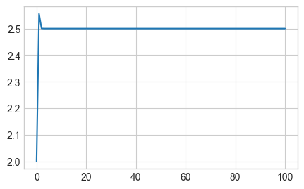
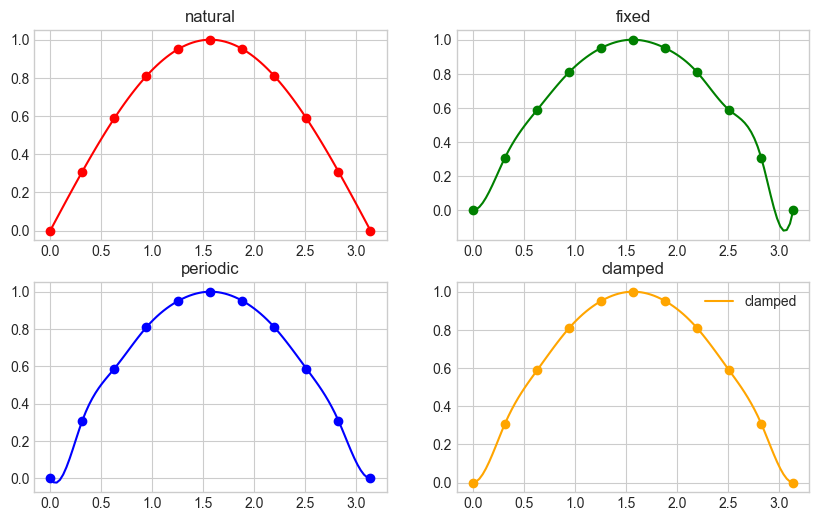
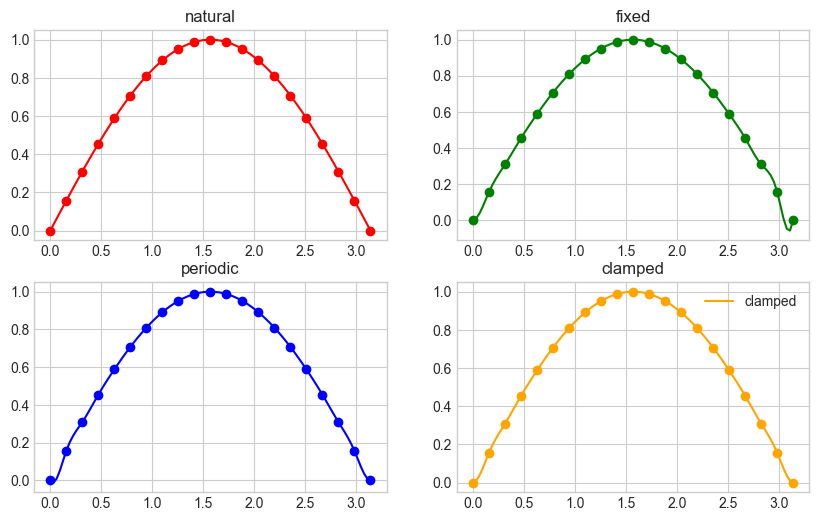
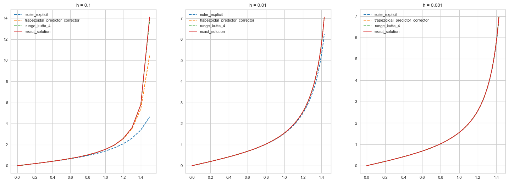
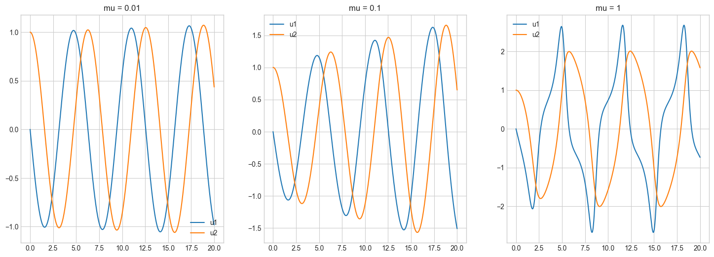
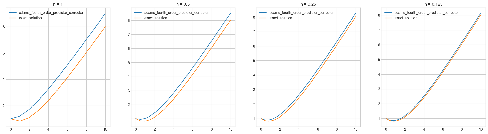

# 《数值计算方法》实验报告

<center> 202200130119 于斐 </center>

## 第一章作业上机实验

### 求方程 $x^2 + (\alpha - \beta) x + 10^9 = 0$ 的根。其中 $\alpha = -10^9, \beta = -1$，讨论如何设计计算格式才能有效减少误差，提高运算精度。

由于待求解方程组为一元二次方程组，因此可直接使用求根公式 $$x = \cfrac{-b \pm \sqrt{b^2 - 4ac}}{2a}$$ 求解。在题设背景中，$a = 1, b = \alpha + \beta = -10^9 - 1, c = 10^9$。

注意到 $|b| = \sqrt{b^2 - 4ac}$，且 $b < 0$，因此应用改进形式，使用分子有理化：
$$
x = \cfrac{-2c}{b \pm \sqrt{b^2 - 4ac}}
$$

解得 $x_1 = 10^9$，$x_2 = 1$。Python 求解代码如下：

```python
alpha, beta = -1e9, -1
a, b, c = 1, alpha + beta, 1e9

x1, x2 = (-2 * c) / (b + (b ** 2 - 4 * a * c) ** 0.5) \
       , (-2 * c) / (b - (b ** 2 - 4 * a * c) ** 0.5)

print(x1, x2)
```

### 以计算 $x^{31}$ 为例，讨论如何设计计算格式才能减少计算次数。

注意到例如 $31 = 2^0 + 2^1 + 2^2 + 2^3 + 2^4$，任何正整数均有唯一一个二进制拆分方式。

令 $f_i = x^{2^i}$，注意到 $f_i = f_{i - 1} \times f_{i - 1}$。因此可以在将指数做二进制分解的同时，通过迭代方式计算 $f_i$。从而在 $\mathcal{O}(\log x)$ 时间复杂度内计算 $a^x$（$a = \text{const}$），远优于朴素乘法的 $\mathcal{O}(x)$。

例如，对 $x^{31}$，可分解为 $x^{2^0} \times x^{2^1} \times x^{2^2} \times x^{2^3} \times x^{2^4}$ 的形式。

假设 $x = 42$，求得 $x^31 = 209280132851277227501988209234026802122409700753408$。Python 求解代码如下：

```python
def fpow(x: float, y: int) -> float:
    res: float = 1
    while y:
        if y & 1:
            res *= x
        x *= x
        y >>= 1
    return res

x, y = 42, 31
print(fpow(x, y))
```

## 第二章作业上机实验

### 求方程 $2x^2 + x - 15 = 0$ 的正根（$x^* = 2.5$）近似值。

提供的三种方法分别是两种不动点迭代方法和牛顿法。

$x_{k+1} = 15 - x_k^2$ 不收敛，因数值过大无法计算。后发现是 typo，修正为 $x_{k + 1} = g(x_{k}) = x_k - f(x_k) = 15 - 2x_k^2$，但仍然数值过大无法计算。

注意到 $|g'(2)| = |-8| = 8 > 1$（即便在错误情况 $x_{k + 1} = 15 - x_k^2$ 下也有 $|g'(2)| = 4 > 1$），不满足不动点法的收敛条件。序列发散。

设 $f(x) = 2x^2 + x - 15$，结果如图：


$x_{k + 1} = x_k - \cfrac{2x_k^2 + x_k - 15}{4x_k + 1}$ 结果如图：



**收敛性分析**


#### $x_{k+1} = 15 - 2x_k^2$
这个公式基于将方程变形为：
$ 2x^2 + x - 15 = 0 \implies x = 15 - x^2 $

**稳定性和收敛性分析：**

同上，令 $g(x) = 15 - 2x_k^2$。注意到 $$|g'(2)| = |-8| = 8 > 1$$ 不满足不动点法的收敛条件，不收敛。

同时：

- 在根 $x^* = 2.5$ 附近，设 $x_k = x^* + \varepsilon_k$，其中 $\varepsilon_k$ 是小的偏差。
- 代入迭代公式：
  $$ x_{k+1} = 15 - (x^* + \varepsilon_k)^2 $$
  $$ x_{k+1} = 15 - (2.5 + \varepsilon_k)^2 $$
  $$ x_{k+1} = 15 - (6.25 + 5\varepsilon_k + \varepsilon_k^2) $$
  $$ x_{k+1} = 8.75 - 5\varepsilon_k - \varepsilon_k^2 $$
- 对于小的 $\varepsilon_k$，忽略 $\varepsilon_k^2$ 项：
  $$ x_{k+1} \approx 8.75 - 5\varepsilon_k $$
  误差 $\varepsilon_k$ 被放大了 5 倍，这个迭代公式是不稳定的并且是发散的。

#### $x_{k+1} = \cfrac{15}{2x_k + 1}$
这个公式基于将方程变形为：
$ 2x^2 + x - 15 = 0 \implies x = \cfrac{15}{2x + 1} $

**稳定性和收敛性分析：**
- 在根 $x^* = 2.5$ 附近，设 $x_k = x^* + \varepsilon_k$，其中 $\varepsilon_k$ 是小的偏差。
- 代入迭代公式：
  $$ x_{k+1} = \frac{15}{2(x^* + \varepsilon_k) + 1} $$
  $$ x_{k+1} = \frac{15}{2(2.5 + \varepsilon_k) + 1} $$
  $$ x_{k+1} = \frac{15}{6 + 2\varepsilon_k} $$
  $$ x_{k+1} \approx \frac{15}{6(1 + \frac{2\varepsilon_k}{6})} $$
  $$ x_{k+1} \approx \frac{15}{6} \cdot \left(1 - \frac{2\varepsilon_k}{6}\right) $$
  $$ x_{k+1} \approx 2.5 \cdot \left(1 - \frac{\varepsilon_k}{3}\right) $$
  $$ x_{k+1} \approx 2.5 - \frac{2.5\varepsilon_k}{3} $$
  $$ x_{k+1} \approx 2.5 - 0.833\varepsilon_k $$
- 这里误差 $\varepsilon_k$ 被缩小了约 0.833 倍，这个迭代公式是收敛的，但是线性收敛。

#### $x_{k+1} = x_k - \cfrac{2x_k^2 + x_k - 15}{4x_k + 1}$
这个公式基于牛顿法：
$$ f(x) = 2x^2 + x - 15 $$
$$ f'(x) = 4x + 1 $$
$$ x_{k+1} = x_k - \frac{f(x_k)}{f'(x_k)} = x_k - \frac{2x_k^2 + x_k - 15}{4x_k + 1} $$

**稳定性和收敛性分析：**
- 在根 $x^* = 2.5$ 附近，设 $x_k = x^* + \varepsilon_k$，其中 $\varepsilon_k$ 是小的偏差。
- 牛顿法通常具有二阶收敛速度：
  $$ x_{k+1} = x_k - \frac{f(x^* + \varepsilon_k)}{f'(x^* + \varepsilon_k)} $$

- 由于牛顿法的二阶收敛性质：
  $$ \varepsilon_{k+1} \approx C\varepsilon_k^2 $$
  其中 $C$ 是一个常数，该方法是二阶收敛且稳定。

#### 总结
- $x_{k+1} = 15 - x_k^2$：不稳定，发散。
- $x_{k+1} = \cfrac{15}{2x_k + 1}$：稳定，线性收敛。
- $x_{k+1} = x_k - \cfrac{2x_k^2 + x_k - 15}{4x_k + 1}$：稳定，二阶收敛。

### 证明方程 $2 - 3x - \sin x = 0$ 在 $(0, 1)$ 内有且仅有一个实根。使用二分法求误差不大于 $0.0005$ 的根，及需要的迭代次数。

令 $f(x) = 2 - 3x - \sin x$，有 $f'(x) = -3 - \cos x < 0$，因此其在定义域内单调递减。又 $f(0) = 2$，$f(1) = -1 - \sin 1 < 0$，故 $f(x) = 0$ 在 $(0, 1)$ 内只有一个实根。

在使用二分法迭代约 $11$ 次后，解得 $x = 0.50537109375$，此时 $f(x) = 0.0016466850065690042$，且误差在 $0.0005$ 以内。

Python 代码如下：

```python
def f(x: float) -> float:
    return 2 - 3 * x - math.sin(x)

TOL = 0.0005
l, r = 0, 1
cnt = 0
while (r - l) > TOL:
    cnt += 1
    x = (l + r) / 2
    if f(x) > 0:
        l = x
    else:
        r = x

print(x, cnt, f(x))
```

### 利用牛顿法求解方程
> $$ \cfrac 12 + \cfrac 14 x^2 - x \sin x - \cfrac 12 \cos 2x = 0$$
> 分别取 $x_0 = \cfrac \pi 2, 5 \pi, 10 \pi$ 使得精度不小于 $10^{-5}$。比较初值对计算结果的影响。

结果如下，其中 `res` 代表最终的结果，`cnt` 代表迭代次数：

```plain
x0 = 1.5707963267948966, res = 1.8954884189769137, cnt = 15
x0 = 15.707963267948966, res = 1.8954890013731998, cnt = 19
x0 = 31.41592653589793, res = 1.8955029706849522, cnt = 428
```

其中对于 $x_0 = 10 \pi$，其迭代次数达到了 $428$ 次，且结果不符合精度要求（标准值 $1.89549426$）。

初值对结果的影响是，虽然最终结果是相同的，但是迭代次数可能会有所不同。如果初值过大，可能会导致迭代次数过多，甚至不收敛。

### 已知 $f(x) = 5x - e^x$ 在 $(0, 1)$ 之间有一个实根，试分别利用二分法、牛顿法、割线法、错位法设计相关的计算格式，并编程求解。精确到四位小数。

在二分法中，取二分点为 $x = \frac{l + r}{2}$，在牛顿法中，取初始点为 $x_0 = 0.5$，在割线法中，取初始点为 $x_0 = 0, x_1 = 1$，在错位法中，取初始点为 $x_0 = 0, x_1 = 1$，结果如下：

```plain
bisection: res = 0.25921630859375, cnt = 14
newton: res = 0.25917110166149104, cnt = 3
secant: res = 0.2591712288816814, cnt = 4
regula_falsi: res = 0.25917408510579704, cnt = 4
```

Python 代码如下：

```python
def f(x: float) -> float:
    return 5 * x - math.exp(x)

def df(x: float) -> float:
    return 5 - math.exp(x)

def bisection(l: float, r: float) -> float:
    TOL = 1e-4
    cnt = 0
    while (r - l) > TOL:
        cnt += 1
        x = (l + r) / 2
        if f(x) * f(r) < 0:
            l = x
        else:
            r = x
    return x, cnt

def newton(x0: float) -> float:
    TOL = 1e-4
    cnt = 0
    while True:
        cnt += 1
        x = x0 - f(x0) / df(x0)
        if abs(x - x0) < TOL:
            break
        x0 = x
    return x, cnt

def secant(x0: float, x1: float) -> float:
    TOL = 1e-4
    cnt = 0
    while True:
        cnt += 1
        x = x1 - f(x1) * (x1 - x0) / (f(x1) - f(x0))
        if abs(x - x1) < TOL:
            break
        x0, x1 = x1, x
    return x, cnt

def regula_falsi(x0: float, x1: float) -> float:
    TOL = 1e-4
    cnt = 0
    while True:
        cnt += 1
        x = x1 - f(x1) * (x1 - x0) / (f(x1) - f(x0))
        if abs(x - x1) < TOL:
            break
        if f(x) * f(x1) < 0:
            x0 = x
        else:
            x1 = x
    return x, cnt

l, r = 0, 1
res, cnt = bisection(l, r)
print(f'bisection: res = {res}, cnt = {cnt}')

x0 = 0.5
res, cnt = newton(x0)
print(f'newton: res = {res}, cnt = {cnt}')

x0, x1 = 0, 1
res, cnt = secant(x0, x1)
print(f'secant: res = {res}, cnt = {cnt}')

x0, x1 = 0, 1
res, cnt = regula_falsi(x0, x1)
print(f'regula_falsi: res = {res}, cnt = {cnt}')
```

## 第三章作业上机实验

### 基于不同边界条件的样条函数计算公式推导：自然边界、固定边界、周期边界、强制第一个子区间和第二个子区间样条多项式的三阶导数相同，倒数第二个子区间和最后一个子区间的三次样条函数的三阶导数相等。

对于一个在节点 $(x_0, y_0), (x_1, y_1), \cdots, (x_n, y_n)$ 上的三次样条函数 $S(x) $，可以表示为：

$ S_i(x) = a_i + b_i(x - x_i) + c_i(x - x_i)^2 + d_i(x - x_i)^3 \quad \text{for} \; x \in [x_i, x_{i+1}] $

#### 自然边界

在自然边界条件下，要求在端点处的二阶导数为零。这意味着样条函数的曲率在边界上为零，常用于边界不受约束的情况。

自然边界条件：$ S''(x_0) = 0, S''(x_n) = 0 $

$ h_i = x_{i+1} - x_i$，$\Delta y_i = y_{i+1} - y_i $

构建样条函数 $ S_i(x) $ 的系统：

$ S_i''(x_{i+1}) = S_{i+1}''(x_{i+1})$，$\int_{x_i}^{x_{i+1}} S_i''(x) \, \text{ d} x = \Delta y_i - \frac{h_i}{6}(c_i + 2c_{i+1})$，$S''(x_0) = 0$，$S''(x_n) = 0 $

最终会得到一个三对角矩阵的线性方程组，可以用来解 $ c_i $，然后反过来求 $ a_i $，$ b_i $ 和 $ d_i $。

#### 固定边界

在固定边界条件下，要求在端点处的一阶导数（斜率）给定。设端点处的斜率为 $ f'(x_0) $ 和 $ f'(x_n) $。

固定边界条件：$ S'(x_0) = f'(x_0), S'(x_n) = f'(x_n) $

对于固定边界条件，构建样条函数 $ S_i(x) $ 的系统：

$ S_i(x_i) = y_i$，$S_i(x_{i+1}) = y_{i+1}$，$S_i'(x_i) = f'(x_i)$，$S_i'(x_{i+1}) = f'(x_{i+1}) $

#### 周期边界

周期边界条件用于周期性数据，这时要求样条函数及其导数在首尾相接处一致。

周期边界条件：$ S(x_0) = S(x_n)$，$S'(x_0) = S'(x_n)$，$S''(x_0) = S''(x_n) $

对于周期边界条件，需要解以下线性方程组：

$ S_0(x_0) = S_{n-1}(x_n)$，$S_0'(x_0) = S_{n-1}'(x_n)$，$S_0''(x_0) = S_{n-1}''(x_n) $

并结合内部节点的连续性条件来形成完整的方程组。

#### 第一个子区间和第二个子区间样条多项式的三阶导数相等，倒数第二个子区间和最后一个子区间的三次样条函数的三阶导数相等

$ S'''_0(x) = S'''_1(x) \quad \text{for} \; x \in [x_0, x_1]$，$S'''_{n-1}(x) = S'''_n(x) \quad \text{for} \; x \in [x_{n-1}, x_n] $

### 以 $y = \sin(x)$ 为例，在 $[0,π]$ 区间内生成 $11$ 个、$21$ 个数据点，设计算法或程序，用上述 $4$ 个边界条件，分别计算其样条插值，并作图比较，分析其差异性。



上图是 $y = \sin(x)$ 在采样点数量为 $11$ 的情况下，四个边界条件的样条插值图像。注意到差异主要集中在两个端点，自然边界和固定边界的样条插值在端点处的导数为 $0$，而周期边界和强制边界的样条插值在端点处的导数不为 $0$，因此在端点处的样条插值图像有明显差异。



上图是 $y = \sin(x)$ 在采样点数量为 $21$ 的情况下，四个边界条件的样条插值图像。

### 求一个次数不高于 $4$ 次的多项式，满足某个条件。

#### $f(1) = f'(1) = 0$，$f(2) = f'(2) = 0$，$f(3) = 1$

构造多项式 $$f(x) = a(x - 1)^2 (x - 2)^2.$$

该多项式天然满足 $f(1) = f'(1) = 0$，$f(2) = f'(2) = 0$，现令 $f(3) = 1$。

$$f(3) = 4a = 1 \Rightarrow a = \cfrac 14$$

因此有 $$f(x) = \cfrac 14(x - 1)^2 (x - 2)^2$$ 满足上述特征。Python 验证代码如下：

```python
def f(x: float) -> float:
    return 0.25 * (x - 1) ** 2 * (x - 2) ** 2

def df(x: float) -> float:
    return 0.5 * (x - 1) * (x - 2) * (2 * x - 3)

print(f'f(1) = {f(1)}, f\'(1) = {df(1)}, f(2) = {f(2)}, f\'(2) = {df(2)}, f(3) = {f(3)}')
```

结果为 `f(1) = 0.0, f'(1) = 0.0, f(2) = 0.0, f'(2) = 0.0, f(3) = 1.0`。

#### $f(0) = f'(0) = 0$，$f(1) = f'(1) = 1$，$f(2) = 1$

令 $f(x) = ax^4 + bx^3 + cx^2 + \text{ d} x + e$。由 $f(0) = f'(0) = 0$，有 $d = e = 0$。故 $f(x) = ax^4 + bx^3 + cx^2$。

接下来构造如下方程：

- $f(1) = 1$：$a + b + c = 1$；
- $f'(1) = 1$：$4a + 3b + 2c = 1$；
- $f'(2) = 1$：$16a + 8b + 4c = 1$。

求解线性方程组，得 $a = 0.25, b = -1.5, c = 2.25$。故有 $$ f(x) = 0.25 x^4 - 1.5x^3 + 2.25x^2$$

```python
A = np.array([[1, 1, 1], [4, 3, 2], [16, 8, 4]])
B = np.array([1, 1, 1])
X = np.linalg.solve(A, B)

print(X)

def f(x: float) -> float:
    return X[0] * x ** 4 + X[1] * x ** 3 + X[2] * x ** 2

def df(x: float) -> float:
    return 4 * X[0] * x ** 3 + 3 * X[1] * x ** 2 + 2 * X[2] * x

print(f'f(0) = {f(0)}, f\'(0) = {df(0)}, f(1) = {f(1)}, f\'(1) = {df(1)}, f(2) = {f(2)}')
```

验证结果得 `f(0) = 0.0, f'(0) = 0.0, f(1) = 1.0, f'(1) = 1.0, f(2) = 1.0`。

### 怎么选定步长 $h$，才能使得分段线性插值函数和 $\sin x$ 的误差小于 $\cfrac 12 \times 10^{-6}$。

对于分段线性插值，在节点之间的最大误差可以由以下公式近似：$$ |E(x)| \leq \frac{M}{8} h^2 $$ 其中 $M = \max \sin'' x$。因为 $\sin x$ 的二阶导数是 $-\sin x$，它的最大绝对值为 $1$。因此 $ M = 1$。

所以误差公式简化为：$$ |E(x)| \leq \frac{h^2}{8} $$

希望这个误差小于 $\cfrac{1}{2} \times 10^{-6}$，那么有 $$ \frac{h^2}{8} \leq \frac{1}{2} \times 10^{-6} \Rightarrow h^2 \leq 4 \times 10^{-6} \Rightarrow h \leq 2 \times 10^{-3} $$

因此需要选择步长 $ h \leq 2 \times 10^{-3} $。

### 求满足下列条件的三次样条插值函数 $s(x)$：$s(1) = s(2) = 1, s(3) = 2, s'(1) = 0, s'(3) = 3$。

根据定义，$$ s(x) = \begin{cases}
s_1(x), & 1 \leq x \leq 2 \\
s_2(x), & 2 < x \leq 3
\end{cases} $$ 其中 $$ s_1(x) = a_1 + b_1(x - 1) + c_1(x - 1)^2 + d_1(x - 1)^3 \\
s_2(x) = a_2 + b_2(x - 2) + c_2(x - 2)^2 + d_2(x - 2)^3 $$

基于题意和三次样条插值函数的连续特征，有以下条件：

1. $ s(1) = 1 $
2. $ s(2) = 1 $
3. $ s(3) = 2 $
4. $ s'(1) = 0 $
5. $ s'(3) = 3 $
6. $ s_1(2) = s_2(2) $
7. $ s_1'(2) = s_2'(2) $

根据条件，可以推出以下线性方程组：

1. $ s_1(1) = a_1 = 1 $
2. $ s_1(2) = a_1 + b_1(1) + c_1(1)^2 + d_1(1)^3 = 1 $
3. $ s_2(2) = a_2 = 1 $
4. $ s_2(3) = a_2 + b_2(1) + c_2(1)^2 + d_2(1)^3 = 2 $
5. $ s_1'(1) = b_1 = 0 $
6. $ s_2'(3) = b_2 + 2c_2(1) + 3d_2(1)^2 = 3 $
7. $ s_1'(2) = b_1 + 2c_1(1) + 3d_1(1)^2 = s_2'(2) = b_2 $

求解得到 $$a_1 = 1.0, a_2 = 0.0, a_3 = 1.0, a_4 = -1.0, b_1 = 1.0, b_2 = -1.0, b_3 = 2.0, b_4 = -0.0$$ 故最终有
$$
s(x) = \begin{cases}
-(x - 1)^3 + (x - 1)^2 + 1, & 1 \leq x \leq 2 \\
2(x - 2)^2 - (x - 2) + 1, & 2 < x \leq 3
\end{cases}
$$

这是满足所有条件的三次样条插值函数。Python 求解、验证代码如下：

```python
A = np.array([[1, 0, 0, 0, 0, 0, 0, 0], \
              [1, 1, 1, 1, 0, 0, 0, 0], \
              [0, 0, 0, 0, 1, 0, 0, 0], \
              [0, 0, 0, 0, 1, 1, 1, 1], \
              [0, 1, 0, 0, 0, 0, 0, 0], \
              [0, 0, 0, 0, 0, 1, 2, 3], \
              [0, 1, 2, 3, 0, -1, 0, 0], \
              [0, 0, 1, 0, 0, 0, 0, 0]])
B = np.array([1, 1, 1, 2, 0, 3, 0, 1])
X = np.linalg.solve(A, B)

def s(x: float) -> float:
    if x < 2:
        return X[0] + X[1] * (x - 1) + X[2] * (x - 1) ** 2 + X[3] * (x - 1) ** 3
    else:
        return X[4] + X[5] * (x - 2) + X[6] * (x - 2) ** 2 + X[7] * (x - 2) ** 3

def ds(x: float) -> float:
    if x < 2:
        return X[1] + 2 * X[2] * (x - 1) + 3 * X[3] * (x - 1) ** 2
    else:
        return X[5] + 2 * X[6] * (x - 2) + 3 * X[7] * (x - 2) ** 2

print(f's(1) = {s(1)}, s(2) = {s(2)}, s(3) = {s(3)}, s\'(1) = {ds(1)}, s\'(3) = {ds(3)}')
```

输出结果为 `s(1) = 1.0, s(2) = 1.0, s(3) = 2.0, s'(1) = 0.0, s'(3) = 3.0`。

## 第四章作业上机实验
### 推导复合梯形公式及其误差估计；推导基于误差控制的逐次半积分梯形公式及其误差估计。

#### 复合梯形公式推导

假设需要计算 $\int_a^b f(x) \text{ d} x$。

将 $[a, b]$ 分为 $n$ 个小区间，每个小区间宽度 $h = \cfrac{b - a}{n}$。对每个小区间使用梯形法则。设 $x_j = a + j \cdot h$。

梯形法则：
$$
\int _a^b f(x) \text{ d} x = \cfrac h2 [f(x_0) + f(x_1)] - \cfrac{h^3}{12} f''(\xi) 
$$

在所有子区间上应用梯形法则，有 
$$
\int _a^b f(x) \text{ d} x = \cfrac h2 \sum \limits_{i = 0}^{n - 1} (f(x_i) + f(x_{i + 1})) - \sum \limits_{i = 0}^{n - 1} \cfrac{h^3}{12} f''(\xi_i) 
$$
其中 $\xi_i \in (x_i, x_{i + 1})$。

将上式拆为估计值和误差部分。对估计值部分，有 
$$
\cfrac h2 \sum \limits_{i = 0}^{n - 1} (f(x_i) + f(x_{i + 1})) = \cfrac h2 \left( f(a) + f(b) + 2 \sum \limits_{i = 1}^{n - 1} f(x_i)  \right)
$$

对误差部分，不妨设 $E(f) = - \sum \limits_{i = 0}^{n - 1} \cfrac{h^3}{12} f''(\xi_i)$。因为 $f \in C^2[a, b]$，故 $f''$ 在 $[a, b]$ 上连续，有最大最小值，即 
$$
\min \limits_{x \in [a, b]} f''(x) \leq f''(\xi_i) \leq \max \limits_{x \in [a, b]} f''(x)
$$

故有 
$$
\min \limits_{x \in [a, b]} f''(x) \leq \cfrac 1n \sum \limits_{i = 0}^{n - 1} f''(\xi_i) \leq \max \limits_{x \in [a, b]} f''(x)
$$

由中值定理，有 
$$
\exists \mu \in (a, b), f''(\mu) = \cfrac 1n \sum \limits_{i = 0}^{n - 1} f''(\xi_i) 
$$
故 $E(f) = \cfrac {h^3}{12} n f''(\mu)$。最终有 
$$
\int_{a}^{b} f(x) \text{ d} x = \cfrac h2 \left[ f(a) + f(b) + 2 \sum \limits_{i = 1}^{n - 1} f(x_i) \right] - \cfrac{h^2}{12} (b - a) f''(\mu)
$$

Let $f \in C^2[a, b], h = (b - a) / n$, and $x_j = a + jh$ for each $j = 0, 1, \cdots, n$.

To prove there exists a $\mu \in (a, b)$ for which the Composite trapezoidal rule for $n$ subintervals can be written with its error term as 

$$
\int_a^b f(x) \text{ d} x = \cfrac h2 [f(a) + 2 \sum \limits_{j = 1}^{n - 1} f(x_j) + f(b)] - \cfrac{b - a}{12} h^2 f''(\mu). 
$$

Let $T(f, h) = \cfrac h2 [f(a) + f(b)] + h \sum \limits_{j = 1}^{n - 1} f(x_j)$, and thus $\int_a^b f(x) \text{ d} x = T(f, h) + E_T(f, h)$.

The key is to prove that there exists $\mu \in (a, b)$, $E_T(f, h)$ can be represented as $\cfrac{- (b - a)}{12} h^2 f''(\mu)$.

First, determine the error term of the formula on $[x_0, x_1]$. Integrate the Lagrange polynomial $P_1(x)$ and its remainder 

$$
\int_{x_0}^{x_1} f(x) \text{ d} x = \int_{x_0}^{x_1} P_1(x) \text{ d} x + \int_{x_0}^{x_1} \cfrac{(x - x_0) (x - x_1)}{2!} f''(c(x)) \text{ d} x.
$$

On $[x_0, x_1]$, $(x - x_0)(x - x_1)$ will always be non-positive, and $f''(c(x))$ is continguous on $[x_0, x_1]$. According to $\textit{the second mean value theorem of integrals}$, there exists $c_1$, 

$$
    \int_{x_0}^{x_1} f(x) \text{ d} x = \cfrac h2 (f_0 + f_1) + f''(c_1) \int_{x_0}^{x_1} \cfrac{(x - x_0)(x - x_1)}{2!} \text{ d} x.
$$

Let $x = x_0 + ht$: 

$$
\begin{aligned}
    \int_{x_0}^{x_1} f(x) \text{ d} x &= \cfrac h2 (f_0 + f_1) + \cfrac{f''(c_1)}{2} \int_{0}^{1} {h(t - 0)h(t - 1)h} \text{ d} t \\
    &= \cfrac h2 (f_0 + f_1) + \cfrac{f''(c_1)}{2} h^3 \int_{0}^{1} t(t - 1) \text{ d} t \\
    &= \cfrac h2 (f_0 + f_1) - \cfrac{f''(c_1)}{12} h^3. \\
\end{aligned}
$$

Consider 

$$
\int_a^b f(x) \text{ d} x = \sum\limits_{k = 1}^{M} \int_{x_{k - 1}}^{x_k} f(x) \text{ d} x = \sum\limits_{k = 1}^{M} \cfrac h2 (f(x_{k - 1}) + f(x_k)) - \cfrac{h^3}{12} \sum\limits_{k = 1}^{M} f''(c_k),
$$

The first $\sum$ is $T(f, h)$. For the second $\sum$, let $h = \cfrac{b - a}{M}$, and 

$$
\int_a^b f(x) \text{ d} x = T(f, h) - \cfrac{(b - a)h^2}{12} \left(\cfrac 1M \sum\limits_{k = 1}^{M} f''(c_k) \right) = T(f, h) - \cfrac{(b - a)h^2}{12} f''(c).
$$

#### 逐次半积分梯形积分

##### Preface

Suppose that we want to approximate $\int_a^b f(x) \text{ d} x$ using \textbf{Composite Trapzoidal Rule} to within a specified tolerance $\varepsilon > 0$.

Let $n = 2$, thus $h_1 = h = (b - a) / 2$. The procedure by \textbf{Composite Trapzoidal Rule} results in the following: 

$$
\int_a^b f(x) \text{ d} x = \cfrac h2 (f(a) + f(b)) - \cfrac{h^3}{12} f^{(2)}(\mu), \mu \in (a, b).
$$

Let $n = 4$ and step size $h_2 = (b - a) / 4 = h / 2$ giving 

$$
\begin{aligned}
\int_a^b f(x) \text{ d} x &= \cfrac {h_2} 2 \left[ f(a) + 2f(a + h) + f(b) \right] - \cfrac{h^3}{12} f^{(2)}(\mu) \\
&=  \cfrac h 4 \left[ f(a) + 2f(a + h) + f(b) \right] - \left( \cfrac h2 \right)^2 
 \cfrac{(b - a)}{24} f^{(2)}(\overset{\sim}{\mu}).
\end{aligned}
$$

The error estimation is derived by assuming that $\mu = \overset{\sim}{\mu}$.

Let $T(l, r) = \cfrac h4 [f(l) + f(r)]$, and it can be figured out that 

$$
T(a, \cfrac{a + b}{2}) + T(\cfrac{a + b}{2}, b) - \cfrac{h^3}{12 \times 4} f^{(2)}(\mu) \approx T(a, b) - \cfrac{h^3}{12} f^{(2)}(\mu).
$$

So 
$$
\cfrac{h^3}{12} f^{(2)}(\mu) \approx \cfrac 43 \left[T(a, b) - T(a, \cfrac{a + b}{2}) - T(\cfrac{a + b}{2}, b) \right],
$$

and

$$
\left | \int_a^b f(x) \text{ d} x - T(a, \cfrac{a + b}{2}) - T(\cfrac{a + b}{2}, b) \right | \approx \cfrac 13 \left[T(a, b) - T(a, \cfrac{a + b}{2}) - T(\cfrac{a + b}{2}, b) \right].
$$

This result means that $T(a, \cfrac{a + b} 2) + T(\cfrac{a + b} 2, b)$ approximates $\int_a^b f(x)$ about 3 times better than it agrees with the known value $T(a, b)$.

##### General Case

Let $n$ be even, thus $h_n = (b - a) / n$.

By the $\textit{Composite Trapzoidal Rule}$, we have 
$$
\int_a^b f(x) \text{ d} x = T(f, h_n) - \cfrac{b - a}{12} h_n^2 f^{(2)}(\mu).
$$
Next let $h_{2n} = (b - a) / 2n = h_n / 2$, 
$$
\int_a^b f(x) \text{ d} x = T(f, h_{2n}) - \cfrac{b - a}{12} \cfrac{h_n^2}{4} f^{(2)}(\mu).
$$
Thus, 
$$
\cfrac{b - a}{12} h_n^2 f^{(2)}(\mu) \approx \cfrac 43 \left[ T(f, h_{n}) - T(f, h_{2n}) \right],
$$
and 
$$
\int_a^b f(x) \text{ d} x - S_{2n} \approx \cfrac 13 \left[ T(f, h_{n}) - T(f, h_{2n}) \right].
$$
Thus, for the given required tolerance $\varepsilon$, if $\left| T(f, h_{n}) - T(f, h_{2n}) \right| < 3 \varepsilon$, then we have 
$$
\int_a^b f(x) \text{ d} x - S_{2n} < \varepsilon.
$$
That is $S_{2n}$ be the required accurate numerical approximation to $\int_a^b f(x) \text{ d} x$.

### Let $h = (b - a) / 3, x_0 = a, x_1 = a + h, x_2 = b$. Find the degree of precision of the quadrature formula $\int_a^b f(x) \text{ d} x = \cfrac 94 hf(x_1) + \cfrac 34 hf(x_2)$.

Let $f(x) = x^m$. When $m = 1$, we have
$$
\text{LHS} = \cfrac 12 (b^2 - a^2) \\ \text{RHS} = \cfrac 1{12} (b - a) \left[ 9(\cfrac {b + 2a}{3}) + 3b \right] = \cfrac 12 (b^2 - a^2) \\ \text{LHS} = \text{RHS}
$$
When $m = 2$, we have
$$
\text{LHS} = \cfrac 13(b^3 - a^3) \\ \text{RHS} = \cfrac{(b - a)(a^2 + ab + b^2)}{3} = \cfrac 13(b^3 - a^3) \\ \text{LHS} = \text{RHS}
$$
When $m = 3$, we have 
$$
\text{LHS} = \cfrac 14(b^4 - a^4) \\ \text{RHS} = \cfrac{-4a^4 - 2a^3b + 3a^2b^2 - 2ab^3 + 5b^4}{18} \\ \text{LHS} \neq \text{RHS}
$$
So the degree of precision of the givem quadrature formula is $2$.

### 自行编制复合梯形公式，Simpson 公式的计算程序，取 $h = 0.01$，计算 $I(f) = \frac{1}{\sqrt{2\pi}} \int_0^1 \exp^{-x^2/2} \text{ d} x$。

Python 求解代码如下：

```python
from scipy import integrate
import math


def f(x: float) -> float:
    return math.exp(-x ** 2 / 2) / math.sqrt(2 * math.pi)

def composite_trapezoidal(f: callable, a: float, b: float, h: float = 0.01) -> float:
    n = int(math.ceil(((b - a) / h)))
    res = 0
    for i in range(1, n):
        res += f(a + i * h)
    return h * (f(a) + 2 * res + f(b)) / 2

def simpson(f: callable, a: float, b: float, h: float = 0.01) -> float:
    n = int(math.ceil(((b - a) / h)))
    res1, res2 = 0, 0
    for i in range(1, n):
        res1 += f(a + i * h)
    for i in range(1, n + 1):
        res2 += f(a + (i - 0.5) * h)
    return h * (f(a) + 2 * res1 + 4 * res2 + f(b)) / 6

a, b, h = 0, 1, 0.01

print(f'composite_trapezoidal: {composite_trapezoidal(f, a, b, h)}')
print(f'simpson: {simpson(f, a, b, h)}')
print(f'exact: {integrate.quad(f, a, b)[0]}')
```

求解得到 $I(f)$ 结果如下：

```plain
composite_trapezoidal: 0.3413427296391172
simpson: 0.3413447460702234
exact: 0.341344746068543
```

Simpson 公式的精准度高于复合梯形公式。当要求计算精度为 $10^{-4}$ 时，可要求 $h = 0.05, n = 20$。

### 分别利用复合梯形、Simpson 公式计算 $I(f) = \int_1^6 （2 + \sin (2 \sqrt{x})) \text{ d} x$。取 $h = 0.5, 0.25, 0.125$。

Python 求解代码如下：

```python
def f(x: float) -> float:
    return 2 + math.sin(2 * math.sqrt(x))

a, b = 1, 6
hs = [0.5, 0.25, 0.125]

for h in hs:
    print(f'composite_trapezoidal at h = {h}: {composite_trapezoidal(f, a, b, h)}')
    print(f'simpson at h = {h}: {simpson(f, a, b, h)}')
```

解得结果如下（保留六位小数）：

| $h$ | 复合梯形公式 | Simpson 公式 |
| :-: | :-: | :-: |
| $0.5$ | $8.193855$ | $8.183447$ |
| $0.25$ | $8.186049$ | $8.183477$ |
| $0.125$ | $8.184120$ | $8.183479$ |

## 第五章作业上机实验

### 求 $y' = 1 + y^2$，$y(0) = 0$ 的数值解（分别用欧拉显格式、梯形预估修正格式、4 阶龙格库塔格式，并与解析解比较这三种格式的收敛性。）

首先求方程解析解，有 
$$
\begin{aligned} \cfrac{\text{d} y}{\text{d} x} & = 1 + y^2 \\ \cfrac{1}{1 + y^2} \text{ d} y & = \text{d} x \\ \int \cfrac{1}{1 + y^2} \text{ d} y & = \int \text{d} x \\ \arctan (y) + C & = x \end{aligned}
$$

又 $y(0) = 0$，有 $C = 0 \Rightarrow y = \tan(x) $。



上图是欧拉显格式、梯形预估修正格式、4 阶龙格库塔格式在 $h = 0,1 0.01, 0.001$ 下对 $[0, \cfrac{5}{11} \pi]$ 这个区间内求解的结果。

在三个 $h$ 取值下，4 阶龙格库塔格式都能够取得比较精确的结果，收敛。  
在 $h = 0.1$ 时，欧拉显式方法最不精确，其次是梯形预估修正格式，二者均不收敛。  
在 $h = 0.01$ 时，欧拉显式方法不收敛，梯形预估修正格式已经开始收敛。  
在 $h = 0.001$ 时，二者都已经开始收敛。  

Python 求解代码如下：

```python
def f(x: float, y: float) -> float:
    return 1 + y ** 2

def euler_explicit(f: callable, a: float, b: float, y0: float, h: float) -> list:
    n = int(math.ceil((b - a) / h))
    x, y = [a], [y0]
    for i in range(1, n + 1):
        x.append(a + i * h)
        y.append(y[-1] + h * f(x[-1], y[-1]))
    return x, y

def trapezoidal_predictor_corrector(f: callable, a: float, b: float, y0: float, h: float) -> list:
    n = int(math.ceil((b - a) / h))
    x, y = [a], [y0]
    for i in range(1, n + 1):
        x.append(a + i * h)
        y.append(y[-1] + h / 2 * (f(x[-1], y[-1]) + f(x[-1] + h, y[-1] + h * f(x[-1], y[-1]))))
    return x, y

def runge_kutta_4(f: callable, a: float, b: float, y0: float, h: float) -> list:
    n = int(math.ceil((b - a) / h))
    x, y = [a], [y0]
    for i in range(1, n + 1):
        x.append(a + i * h)
        k1 = h * f(x[-1], y[-1])
        k2 = h * f(x[-1] + h / 2, y[-1] + k1 / 2)
        k3 = h * f(x[-1] + h / 2, y[-1] + k2 / 2)
        k4 = h * f(x[-1] + h, y[-1] + k3)
        y.append(y[-1] + (k1 + 2 * k2 + 2 * k3 + k4) / 6)
    return x, y

def exact_solution(x: float) -> float:
    return math.tan(x)

import matplotlib.pyplot as plt

plt.style.use('seaborn-whitegrid')

a, b, y0 = 0, math.pi * 5 / 11, 0

hs = [0.1, 0.01, 0.001]
fig, ax = plt.subplots(1, 3, figsize=(18, 6))

for i, h in enumerate(hs):
    x, y = euler_explicit(f, a, b, y0, h)
    ax[i].plot(x, y, label='euler_explicit', linestyle='dashed')
    x, y = trapezoidal_predictor_corrector(f, a, b, y0, h)
    ax[i].plot(x, y, label='trapezoidal_predictor_corrector', linestyle='dashed')
    x, y = runge_kutta_4(f, a, b, y0, h)
    ax[i].plot(x, y, label='runge_kutta_4', linestyle='dashed')
    x = [a + i * h for i in range(int(math.ceil((b - a) / h)) + 1)]
    y = [exact_solution(x_) for x_ in x]
    ax[i].plot(x, y, label='exact_solution')
    ax[i].legend()
    ax[i].title.set_text(f'h = {h}')

plt.show()
    
```

### 用龙格库塔 4 阶方法求解描述振荡器的经典 van der Pol 微分方程，分别取 $\mu = 0.01, 0.1, 1$，作图比较计算结果。
$$
\begin{cases}
\cfrac{\text{d}^2 y}{\text{d}t^2} - \mu (1 - y^2) \cfrac{\text{d} y}{\text{d} t} + y = 0 \\
y(0) = 1, y'(0) = 0
\end{cases}
$$
首先将二阶微分方程转化为一阶微分方程组，令 $u_1(t) = \cfrac{\text{d} y}{\text{d} t}, u_2(t) = y(t)$，有 $$\begin{cases}
u_1' = (\mu (1 - u_2^2) u_1) - u_2 \\
u_2' = u_1
\end{cases}$$

初始时 $u_1 = 0, u_2 = 1$。再对这个方程组用 4 阶龙格库塔方法求解。结果如下图：



Python 求解代码如下：

```python
def u1_prime(t: float, u1: float, u2: float, mu: float) -> float:
    return mu * (1 - u2 ** 2) * u1 - u2

def u2_prime(t: float, u1: float, u2: float, mu: float) -> float:
    return u1

def runge_kutta_4_van_der_pol(mu: float, a: float, b: float, u1_0: float, u2_0: float, h: float) -> list:
    n = int(math.ceil((b - a) / h))
    t, u1, u2 = [a], [u1_0], [u2_0]
    for i in range(1, n + 1):
        t.append(a + i * h)
        k1 = h * u1_prime(t[-1], u1[-1], u2[-1], mu)
        l1 = h * u2_prime(t[-1], u1[-1], u2[-1], mu)
        k2 = h * u1_prime(t[-1] + h / 2, u1[-1] + k1 / 2, u2[-1] + l1 / 2, mu)
        l2 = h * u2_prime(t[-1] + h / 2, u1[-1] + k1 / 2, u2[-1] + l1 / 2, mu)
        k3 = h * u1_prime(t[-1] + h / 2, u1[-1] + k2 / 2, u2[-1] + l2 / 2, mu)
        l3 = h * u2_prime(t[-1] + h / 2, u1[-1] + k2 / 2, u2[-1] + l2 / 2, mu)
        k4 = h * u1_prime(t[-1] + h, u1[-1] + k3, u2[-1] + l3, mu)
        l4 = h * u2_prime(t[-1] + h, u1[-1] + k3, u2[-1] + l3, mu)
        u1.append(u1[-1] + (k1 + 2 * k2 + 2 * k3 + k4) / 6)
        u2.append(u2[-1] + (l1 + 2 * l2 + 2 * l3 + l4) / 6)
    return t, u1, u2

mu = [0.01, 0.1, 1]
a, b, u1_0, u2_0 = 0, 20, 0, 1
h = 0.01

fig, ax = plt.subplots(1, 3, figsize=(18, 6))

for i in range(3):
    t, u1, u2 = runge_kutta_4_van_der_pol(mu[i], a, b, u1_0, u2_0, h)
    ax[i].plot(t, u1, label='u1')
    ax[i].plot(t, u2, label='u2')
    ax[i].title.set_text(f'mu = {mu[i]}')
    ax[i].legend()

plt.show()
```

### 试用 Adams Fourth-Order Predictor-Corrector 格式，求解以下 ODE 的数值解（取 $h = 1, 0.5, 0.25, 0.125$）
$$
\begin{cases}
\cfrac{\text{d} y}{\text{d}t} = \cfrac{t - y}{2} \\
y(0) = 1
\end{cases}
$$
首先求解析解。在 Mathematica 中使用 `sol = DSolveValue[{y'[t] == (t - y[t]) / 2, y[0] == 1}, y[t], t]` 求得解析解为 $$y(t) = t - 2 + 3e^{-t / 2} $$

Adams Fourth-Order Predictor-Corrector 格式求解结果如下：



Python 求解代码如下：

```python
def f(t: float, y: float) -> float:
    return (t - y) / 2

def exact_solution(t: float) -> float:
    return t - 2 + 3 * math.exp(-t / 2)

def adams_fourth_order_predictor_corrector(a: float, b: float, y0: float, h: float) -> list:
    n = int(math.ceil((b - a) / h))
    t, y = [a], [y0]
    for i in range(1, 4):
        t.append(a + i * h)
        k1 = h * f(t[-1], y[-1])
        k2 = h * f(t[-1] + h / 2, y[-1] + k1 / 2)
        k3 = h * f(t[-1] + h / 2, y[-1] + k2 / 2)
        k4 = h * f(t[-1] + h, y[-1] + k3)
        y.append(y[-1] + (k1 + 2 * k2 + 2 * k3 + k4) / 6)
    for i in range(4, n + 1):
        t.append(a + i * h)
        y.append(y[-1] + h / 24 * (55 * f(t[-1], y[-1]) - 59 * f(t[-2], y[-2]) + 37 * f(t[-3], y[-3]) - 9 * f(t[-4], y[-4])))
    return t, y

a, b, y0 = 0, 10, 1
hs = [1, 0.5, 0.25, 0.125]

fig, ax = plt.subplots(1, 4, figsize=(24, 6))

for i, h in enumerate(hs):
    t, y = adams_fourth_order_predictor_corrector(a, b, y0, h)
    ax[i].plot(t, y, label='adams_fourth_order_predictor_corrector')
    t = [a + i * h for i in range(int(math.ceil((b - a) / h)) + 1)]
    y = [exact_solution(t_) for t_ in t]
    ax[i].plot(t, y, label='exact_solution')
    ax[i].title.set_text(f'h = {h}')
    ax[i].legend()

plt.show()
```

## 第六、七章作业上机实验

### 求解线性方程组
$$
\begin{aligned}
4x - y + z & = 7 \\
4x - 8y + z & = -21 \\
-2x + y + 5z & = 15
\end{aligned}
$$
1. 试用 LU 分解求解此方程组；
2. 分别用 Jacobi, Gauss-Seidel 方法求解此方程组。

LU 分解得到的矩阵如下：
$$
L = \begin{bmatrix}
1 & 0 & 0 \\
1 & 1 & 0 \\
-0.5 & -0.071 & 1
\end{bmatrix} \\ ~ \\
R = \begin{bmatrix}
4 & -1 & 1 \\
0 & -7 & 0 \\ 
0 & 0 & 5.5
\end{bmatrix}
$$
在 tolerance 在 $10^{-6}$ 的情况下，求解结果如下：

```plain
LU: [2. 4. 3.]
Jacobi: [1.99999932 3.99999975 3.00000035] with 15 iterations
Gauss-Seidel: [1.99999964 3.99999976 2.9999999 ] with 9 iterations
```

Python 求解代码如下：

```python
A = np.array([[4, -1, 1], [4, -8, 1], [-2, 1, 5]])
B = np.array([7, -21, 15])

def lu_decomposition(A: np.ndarray, B: np.ndarray) -> np.ndarray:
    n = len(A)
    L = np.zeros((n, n))
    U = np.zeros((n, n))
    for i in range(n):
        L[i][i] = 1
        for j in range(i, n):
            U[i][j] = A[i][j] - sum(L[i][k] * U[k][j] for k in range(i))
        for j in range(i + 1, n):
            L[j][i] = (A[j][i] - sum(L[j][k] * U[k][i] for k in range(i))) / U[i][i]
    Y = np.zeros(n)
    for i in range(n):
        Y[i] = B[i] - sum(L[i][j] * Y[j] for j in range(i))
    X = np.zeros(n)
    for i in range(n - 1, -1, -1):
        X[i] = (Y[i] - sum(U[i][j] * X[j] for j in range(i + 1, n))) / U[i][i]
    return L, U, X

L, U, X = lu_decomposition(A, B)

print(L, U, sep='\n')

print(X)

def jacobi(A: np.ndarray, B: np.ndarray, TOL: float) -> np.ndarray:
    n = len(A)
    X = np.zeros(n)
    cnt = 0
    while True:
        cnt += 1
        X_new = np.zeros(n)
        for i in range(n):
            X_new[i] = (B[i] - sum(A[i][j] * X[j] for j in range(n) if j != i)) / A[i][i]
        if max(abs(X_new - X)) < TOL:
            break
        X = X_new
    return X, cnt

X, cnt = jacobi(A, B, 1e-6)
print(X, "with", cnt, "iterations")

def gauss_seidel(A: np.ndarray, B: np.ndarray, TOL: float) -> np.ndarray:
    n = len(A)
    X = np.zeros(n)
    cnt = 0
    while True:
        cnt += 1
        X_new = np.zeros(n)
        for i in range(n):
            X_new[i] = (B[i] - sum(A[i][j] * X_new[j] for j in range(i)) - sum(A[i][j] * X[j] for j in range(i + 1, n))) / A[i][i]
        if max(abs(X_new - X)) < TOL:
            break
        X = X_new
    return X, cnt

X, cnt = gauss_seidel(A, B, 1e-6)
print(X, "with", cnt, "iterations")
```

## 第八章作业上机实验

### 已知观测数据，求一个二次多项式拟合这组数据，试写出其最小二乘拟合模型，并给出其正则方程组及其解。


| $x$ | $-2$ | $-1$ | $0$ | $1$ | $2$ |
| :-: | :-: | :-: | :-: | :-: | :-: |
| $f(x)$ | $0$ | $1$ | $2$ | $1$ | $0$ |

设二次多项式为 $P(x) = a_0 + a_1 x + a_2 x^2$，使用最小二乘拟合求解，$n = 2$ 时可得到以下误差方程 $$\begin{aligned} 
E &= \sum \limits_{i = 1}^{m} [y_i - P(x_i)]^2 \\
  &= \sum \limits_{i = 1}^{m} y_i^2 - 2 \sum \limits_{j = 0}^{2} a_j \left( \sum \limits_{i = 1}^{m} y_i x_i^j \right) + \sum \limits_{j = 0}^{2} \sum \limits_{k = 0}^{2} a_j a_k \left( \sum \limits_{i = 1}^{m} x_i^{j + k} \right)
\end{aligned}$$

求偏导数得 $$\cfrac{\partial E}{\partial a_j} = -2 \sum \limits_{i = 1}^{m} y_i x_i^j + 2 \sum \limits_{k = 0}^{2} a_k \sum \limits_{i = 1}^{m} x_i^{j + k}, \quad j = 0, 1, 2$$

若使误差最小，则应有偏导数为 $0$，得到下面的正则方程组：
$$
\begin{cases}
a_0 \sum x_i^0 + a_1 \sum x_i^1 + a_2 \sum x_i^2 = \sum y_i x_i^0 \\
a_0 \sum x_i^1 + a_1 \sum x_i^2 + a_2 \sum x_i^3 = \sum y_i x_i^1 \\
a_0 \sum x_i^2 + a_1 \sum x_i^3 + a_2 \sum x_i^4 = \sum y_i x_i^2 
\end{cases}
$$
于是解线性方程组即可。解得 $a_0 = 1.65714286, a_1 = 0, a_2 = -0.42857143$，故 $$P(x) = -0.4286 x^2 + 1.6571$$

Python 求解代码如下：

```python
X = np.array([-2, -1, 0, 1, 2])
Y = np.array([0, 1, 2, 1, 0])

def least_squares(X: np.ndarray, Y: np.ndarray, n: int) -> np.ndarray:
    A = np.zeros((n + 1, n + 1))
    B = np.zeros(n + 1)
    for i in range(n + 1):
        for j in range(n + 1):
            A[i][j] = sum(x ** (i + j) for x in X)
        B[i] = sum(Y[j] * X[j] ** i for j in range(len(X)))
    return np.linalg.solve(A, B)

n = 2
a = least_squares(X, Y, n)
print(a)
```

### 研究发现单原子波函数的基本形式为 $y = ae^{-bx}$，试根据实验室测试数据确定参数 $a, b$。

| $x$ | $0$ | $1$ | $2$ | $4$ |
| :-: | :-: | :-: | :-: | :-: |
| $f(x)$ | $2.010$ | $1.210$ | $0.740$ | $0.450$ |

由于按照最小二乘法求偏导对题设背景很困难，因此考虑求对数，有 $$\ln y = \ln a - bx$$

整理上式，可变为求以下多项式的最小二乘拟合：$$t = a^* + b^* x, \quad \text{where } t = \ln y, a^* = \ln a, b^* = -b$$

按照和上一个任务相同的求解方法，求得 $a = 1.81232309, b = 0.36989939$。因此有 $$y = 1.8123e^{-0.3699 x}$$

## 第九章作业上机实验

### 已知矩阵 $\mathbf{A}$ 是一个对称矩阵，且其特征值为 $\lambda_1 = 6, \lambda_2 = 3, \lambda_3 = 1$，分别利用幂法、对称幂法、反幂法求其最大特征值和特征向量。
$$
A = \begin{bmatrix}
4 & -1 & 1 \\
-1 & 3 & -2 \\
1 & -2 & 3
\end{bmatrix}
$$
#### 幂法

其基于 $$\lim \limits_{k \to \infty} \mathbf{A}^k \mathbf{x} = \lim \limits_{k \to \infty} \lambda_1^k \beta_1 \mathbf{v}^{(1)}$$ 其中 $\lambda_1$ 是主特征值，$\mathbf{x} = \sum \beta_j \mathbf{v}^j$。

注意到当 $\vert \lambda_1 \vert > 1$ 时， $||\mathbf{x}^{(k)}|| \to \infty$，故需将迭代向量规范化。

取 $\mathbf{x}^{(0)} = \mathbf{y}^{(0)} = \begin{bmatrix} 1 & 1 & 1 \end{bmatrix}$，$\mathbf{x}^{(k)} = \mathbf{A} \mathbf{y}^{(k - 1)}$，$\mathbf{y}^{(k)} = \cfrac{\mathbf{x}^{(k)}}{||\mathbf{x}^{(k)}||_\infty}$，最终求解的 $\mathbf{x}$ 即为特征向量。

#### 对称幂法

注意到对称矩阵性质，有 $$\mathbf{x}_k^T \mathbf{x}_k = \sum \limits_{j = 1}^{n} \beta_j^2 \lambda_j^{2k} = \beta_1^2 \lambda_1^{2k} \left[ 1 + \sum \limits_{j = 2}^{n} \left( \cfrac{\beta_j}{\beta_1} \right)^2 \left( \cfrac{\lambda_j}{\lambda_n} \right)^{2k} \right]$$ 且 $$\mathbf{x}_k^T \mathbf{A} \mathbf{x}_k = \sum \limits_{j = 1}^{n} \beta_j^2 \lambda_j^{2k + 1} = \beta_1^2 \lambda_1^{2k} \left[ 1 + \sum \limits_{j = 2}^{n} \left( \cfrac{\beta_j}{\beta_1} \right)^2 \left( \cfrac{\lambda_j}{\lambda_n} \right)^{2k + 1} \right]$$ 故有 $$\lim \limits_{k \to \infty} \cfrac{\mathbf{x}_k^T \mathbf{A} \mathbf{x}_k}{\mathbf{x}_k^T \mathbf{x}_k} = \lambda_1$$

可在迭代向量规范化时使用 2 范数，加快收敛。

#### 反幂法

对矩阵 $\mathbf{A}^{-1}$ 用幂法，即可计算最大特征值 $1 / \lambda_n$，即可计算 $\mathbf{A}$ 的最小特征值 $\lambda_n$。

在实际计算中，将矩阵求逆转换为求解线性方程组 $\mathbf{A} \mathbf{x}^{(k + 1)} = \mathbf{x}^{(k)}$ 替代。

若求解最大特征值，则取适当的 $\alpha$，求解 $(\mathbf{A} - \alpha \mathbf{I})^{-1}$ 的最小特征值 $\lambda'$，则 $\mathbf{A}$ 的最大特征值为 $\alpha + 1 / \lambda'$。

在 tolerance 为 $10^{-7}$ 的情况下，求解结果如下：

```plain
power_method: got lambda = 5.999999821186076, X = [ 5.99999982 -5.99999955  5.99999955], with 26 iterations
symmetric_power_method: got lambda = 5.9999999999999165, X = [ 0.57735041 -0.5773502   0.5773502 ], with 24 iterations
inverse_power_method: got lambda = 6.000000006191799, X = [ 1.99999998 -1.99999995  1.99999995], with 13 iterations
```

注意到反幂法在 $\alpha$ 取值适当的情况下收敛速度显著更快。

### 分别利用 Householder 变换和 Givens 旋转变换方法求 $\mathbf{A}$ 的 QR 分解。
$$
\mathbf{A} = \begin{bmatrix}
1 & 0 & 0 \\
1 & 1 & 0 \\
1 & 1 & 1 \\
1 & 1 & 1
\end{bmatrix}
$$
#### Householder 变换

Householder 目标为使得一个矩阵 $\mathbf{H}$ 将一个向量的，除了一个维度以外的其他所有分量，全部转化为 $0$。

对本题有以下求解步骤：

1. 使 $\mathbf{A}$ 的第一列下三行全部归零。

    设 $\mathbf{x} = \begin{bmatrix} 1 & 1 & 1 & 1 \end{bmatrix}^T$，选择 $\mathbf{e_1} = \begin{bmatrix} 1 & 0 & 0 & 0 \end{bmatrix}^T$，构造 $\mathbf{u} = \mathbf{x} - ||\mathbf{x}|| \mathbf{e_1}$。

    解得 $||x|| = 2$，故有 $$ \mathbf{u} = \begin{bmatrix} 1 \\ 1 \\ 1 \\ 1 \end{bmatrix} - 2 \begin{bmatrix} 1 \\ 0 \\ 0 \\ 0 \end{bmatrix} = \begin{bmatrix} -1 \\ 1 \\ 1 \\ 1 \end{bmatrix} $$ 归一化 $ \mathbf{u} $ 得到 $ \mathbf{v} = \frac{\mathbf{u}}{\|\mathbf{u}\|} $。注意到 $ \mathbf{u} $ 的二范数 $ \|\mathbf{u}\| = 2 $，所以 $$ \mathbf{v} = \cfrac{1}{2}\begin{bmatrix} -1 \\ 1 \\ 1 \\ 1 \end{bmatrix} $$

    Householder 矩阵 $ \mathbf{H_1} = I - 2 \mathbf{v} \mathbf{v}^T $:
    $$
    \mathbf{v} \mathbf{v}^T = \frac{1}{4} \begin{bmatrix} -1 \\ 1 \\ 1 \\ 1 \end{bmatrix} \begin{bmatrix} -1 & 1 & 1 & 1 \end{bmatrix} = \frac{1}{4} \begin{bmatrix} 1 & -1 & -1 & -1 \\ -1 & 1 & 1 & 1 \\ -1 & 1 & 1 & 1 \\ -1 & 1 & 1 & 1 \end{bmatrix}
    $$

    $$
    \mathbf{H_1} = I - 2 \mathbf{v} \mathbf{v}^T = I - \frac{1}{2} \begin{bmatrix} 1 & -1 & -1 & -1 \\ -1 & 1 & 1 & 1 \\ -1 & 1 & 1 & 1 \\ -1 & 1 & 1 & 1 \end{bmatrix} = \begin{bmatrix} \frac{1}{2} & \frac{1}{2} & \frac{1}{2} & \frac{1}{2} \\ \frac{1}{2} & \frac{1}{2} & -\frac{1}{2} & -\frac{1}{2} \\ \frac{1}{2} & -\frac{1}{2} & \frac{1}{2} & -\frac{1}{2} \\ \frac{1}{2} & -\frac{1}{2} & -\frac{1}{2} & \frac{1}{2} \end{bmatrix}
    $$

    计算 $ \mathbf{H_1} \mathbf{A} $:
    
    $$
    \mathbf{H_1} \mathbf{A} = \begin{bmatrix} \frac{1}{2} & \frac{1}{2} & \frac{1}{2} & \frac{1}{2} \\ \frac{1}{2} & \frac{1}{2} & -\frac{1}{2} & -\frac{1}{2} \\ \frac{1}{2} & -\frac{1}{2} & \frac{1}{2} & -\frac{1}{2} \\ \frac{1}{2} & -\frac{1}{2} & -\frac{1}{2} & \frac{1}{2} \end{bmatrix} \begin{bmatrix} 1 & 0 & 0 \\ 1 & 1 & 0 \\ 1 & 1 & 1 \\ 1 & 1 & 1 \end{bmatrix} = \begin{bmatrix} 2 & 1 & 1 \\ 0 & 0 & 0 \\ 0 & 0 & -1 \\ 0 & 0 & -1 \end{bmatrix}
    $$

2. 使矩阵 $ \mathbf{H_1} \mathbf{A} $ 的第二列的最后两行元素归零。

    设 $ \mathbf{y} = \begin{bmatrix} 1 \\ 1 \end{bmatrix} $，选择单位向量 $ \mathbf{e}_1 = \begin{bmatrix} 1 \\ 0 \end{bmatrix} $，构造向量 $ \mathbf{w} = \mathbf{y} - \|\mathbf{y}\|\mathbf{e}_1 $。

    计算 $ \|\mathbf{y}\| = \sqrt{2} $，故 $ \mathbf{w} = \begin{bmatrix} 1 \\ 1 \end{bmatrix} - \sqrt{2} \begin{bmatrix} 1 \\ 0 \end{bmatrix} = \begin{bmatrix} 1 - \sqrt{2} \\ 1 \end{bmatrix} $。
    
    归一化 $ \mathbf{w} $ 得到 $ \mathbf{u} = \frac{\mathbf{w}}{\|\mathbf{w}\|} $。注意到 $ \mathbf{w} $ 的二范数 $ \|\mathbf{w}\| = \sqrt{3 - 2\sqrt{2}} $。

    构造第二个 Householder 矩阵 $ \mathbf{H_2} = I - 2 \mathbf{u} \mathbf{u}^T $，$ \mathbf{u} = \frac{1}{\sqrt{2}} \begin{bmatrix} 1 \\ -1 \end{bmatrix} $。

    $$
    \mathbf{H_2} = \begin{bmatrix} 1 & 0 & 0 & 0 \\ 0 & 1 & 0 & 0 \\ 0 & 0 & \frac{1}{2} & \frac{1}{2} \\ 0 & 0 & \frac{1}{2} & -\frac{1}{2} \end{bmatrix}
    $$

    计算 $ \mathbf{H_2} \mathbf{H_1} \mathbf{A} $:

    $$
    \mathbf{H_2} \mathbf{H_1} \mathbf{A} = \mathbf{H_2} \begin{bmatrix} 2 & 1 & 1 \\ 0 & 0 & 0 \\ 0 & 0 & -1 \\ 0 & 0 & -1 \end{bmatrix} = \begin{bmatrix} 2 & 1 & 1 \\ 0 & 0 & 0 \\ 0 & 0 & -\sqrt{2} \\ 0 & 0 & 0 \end{bmatrix}
    $$

此时矩阵已上三角，QR 分解为：

$$
\mathbf{Q} = \mathbf{H_2} \mathbf{H_1}, \quad \mathbf{R} = \begin{bmatrix} 2 & 1 & 1 \\ 0 & 0 & 0 \\ 0 & 0 & -\sqrt{2} \\ 0 & 0 & 0 \end{bmatrix}
$$

#### Givens 旋转变换方法

对于每对 $ a_{ij} $ 和 $ a_{ik} $，引入 Givens 旋转 $ \mathbf{G} $，将 $ a_{ij} $ 变为零。

1. 旋转第一列第 2 和第 1 行，使 $ a_{21} $ 归零

    设 $ c = \cfrac{1}{\sqrt{2}} $，$ s = \cfrac{1}{\sqrt{2}} $，构造 Givens 矩阵：

    $$
    \mathbf{G}_{12} = \begin{bmatrix} \frac{1}{\sqrt{2}} & \frac{1}{\sqrt{2}} & 0 & 0 \\ -\frac{1}{\sqrt{2}} & \frac{1}{\sqrt{2}} & 0 & 0 \\ 0 & 0 & 1 & 0 \\ 0 & 0 & 0 & 1 \end{bmatrix}
    $$

    应用 $ \mathbf{G}_{12} $ 到 $ \mathbf{A} $：

    $$
    \mathbf{G}_{12} \mathbf{A} = \begin{bmatrix} \sqrt{2} & \frac{1}{\sqrt{2}} & 0 \\ 0 & \frac{1}{\sqrt{2}} & 0 \\ 1 & 1 & 1 \\ 1 & 1 & 1 \end{bmatrix}
    $$

2. 旋转第一列第 3 和第 1 行，使 $ A_{31} $ 归零

    设 $ c = \cfrac{\sqrt{2}}{\sqrt{3}} $，$ s = \cfrac{1}{\sqrt{3}} $，构造 Givens 矩阵：

    $$
    \mathbf{G}_{13} = \begin{bmatrix} \frac{\sqrt{2}}{\sqrt{3}} & 0 & \frac{1}{\sqrt{3}} & 0 \\ 0 & 1 & 0 & 0 \\ -\frac{1}{\sqrt{3}} & 0 & \frac{\sqrt{2}}{\sqrt{3}} & 0 \\ 0 & 0 & 0 & 1 \end{bmatrix}
    $$

    应用 $ \mathbf{G}_{13} $ 到 $ \mathbf{G}_{12} \mathbf{A} $：

    $$
    \mathbf{G}_{13} \mathbf{G}_{12} \mathbf{A} = \begin{bmatrix} \sqrt{3} & \frac{\sqrt{2}}{\sqrt{3}} & \frac{1}{\sqrt{3}} \\ 0 & \frac{1}{\sqrt{2}} & 0 \\ 0 & \frac{\sqrt{2}}{\sqrt{3}} & -\frac{1}{\sqrt{3}} \\ 1 & 1 & 1 \end{bmatrix}
    $$

3. 旋转第二列第 4 和第 1 行，使 $ \mathbf{A}_{41} $ 归零

    设 $ c = \cfrac{\sqrt{2}}{\sqrt{3}} $，$ s = \cfrac{1}{\sqrt{3}} $，构造 Givens 矩阵：

    $$
    \mathbf{G}_{14} = \begin{bmatrix} \frac{\sqrt{2}}{\sqrt{3}} & 0 & 0 & \frac{1}{\sqrt{3}} \\ 0 & 1 & 0 & 0 \\ 0 & 0 & 1 & 0 \\ -\frac{1}{\sqrt{3}} & 0 & 0 & \frac{\sqrt{2}}{\sqrt{3}} \end{bmatrix}
    $$

    应用 $ \mathbf{G}_{14} $ 到 $ \mathbf{G}_{13} \mathbf{G}_{12} \mathbf{A} $：

    $$
    \mathbf{G}_{14} \mathbf{G}_{13} \mathbf{G}_{12} \mathbf{A} = \begin{bmatrix} 2 & \frac{\sqrt{2}}{\sqrt{3}} & \frac{1}{\sqrt{3}} \\ 0 & \frac{1}{\sqrt{2}} & 0 \\ 0 & \frac{\sqrt{2}}{\sqrt{3}} & -\frac{1}{\sqrt{3}} \\ 0 & \frac{1}{\sqrt{2}} & \frac{\sqrt{2}}{\sqrt{3}} \end{bmatrix}
    $$

此时矩阵已上三角，QR 分解为：

$$
\mathbf{Q} = \mathbf{G}_{14} \mathbf{G}_{13} \mathbf{G}_{12}, \quad \mathbf{R} = \begin{bmatrix} 2 & \frac{\sqrt{2}}{\sqrt{3}} & \frac{1}{\sqrt{3}} \\ 0 & \frac{1}{\sqrt{2}} & 0 \\ 0 & \frac{\sqrt{2}}{\sqrt{3}} & -\frac{1}{\sqrt{3}} \\ 0 & \frac{1}{\sqrt{2}} & \frac{\sqrt{2}}{\sqrt{3}} \end{bmatrix}
$$